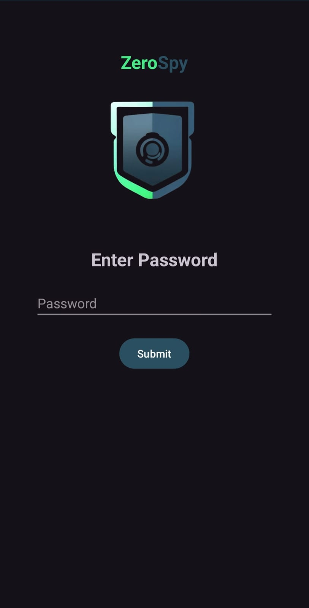
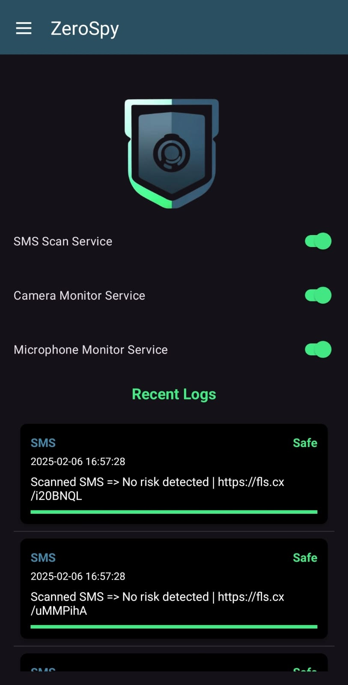
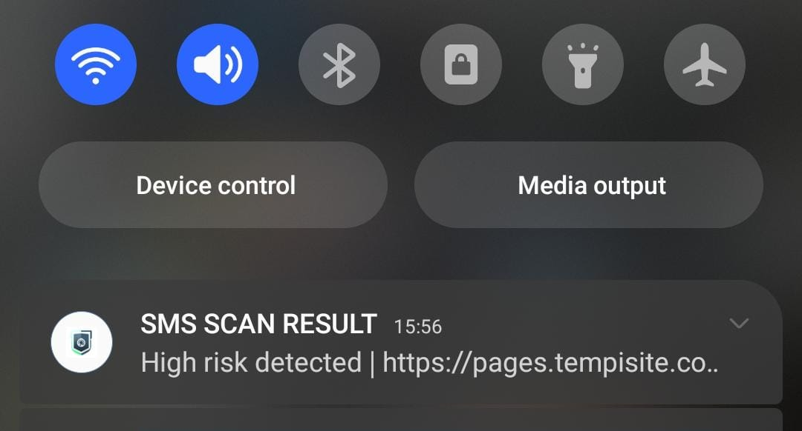
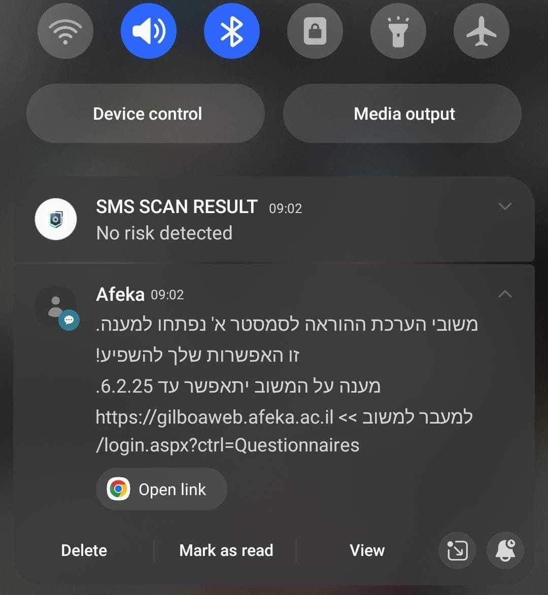
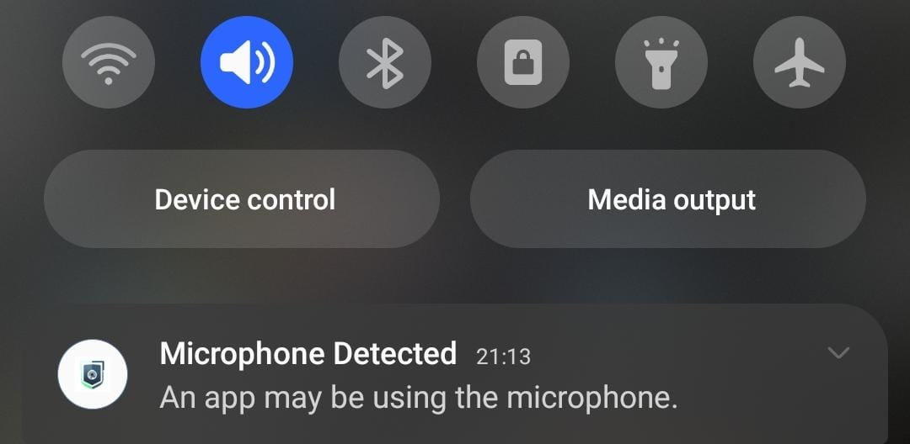
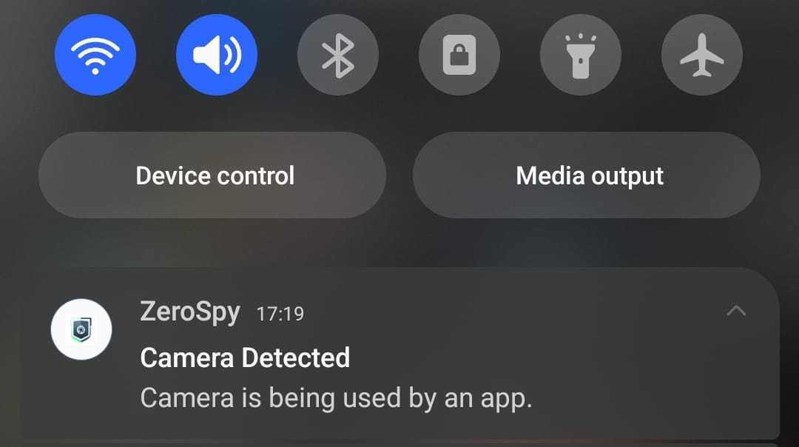
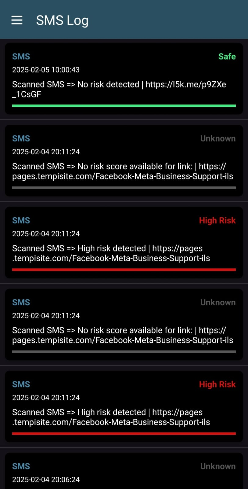
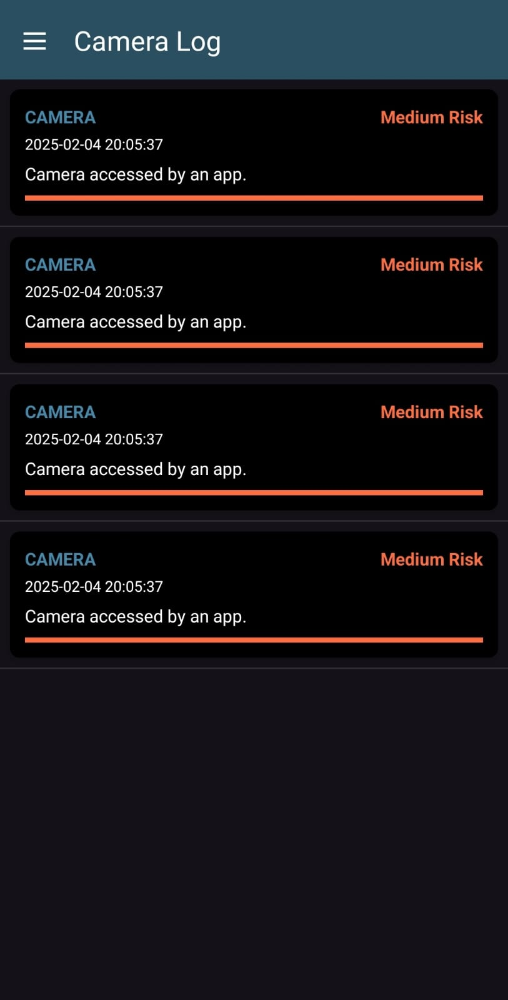
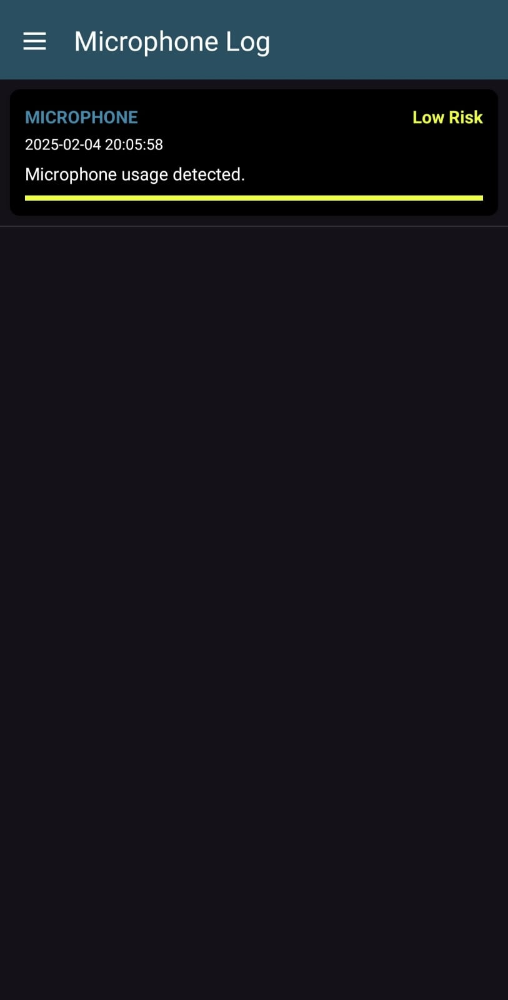

<div style="text-align:center">
    
</div>

# **🔒 ZeroSpy - Privacy & Security Guardian**

**ZeroSpy** is an advanced **Android security app** that helps protect your privacy by **monitoring microphone and camera usage, scanning SMS messages for scam links**, and **logging security events** for review.

🚀 **Stay in control of your privacy and security with ZeroSpy!**

---

## **📌 Features**

✅ **🔍 SMS Scam Detection** – Scans links in SMS messages using **APIVoid URL Reputation API** to detect scams, phishing, and malware.\
✅ **📸 Camera Usage Monitoring** – Detects when an app accesses your device’s camera and **notifies** you.\
✅ **🎤 Microphone Usage Monitoring** – Detects when an app uses the microphone and **alerts** you.\
✅ **🔐 Password Protection** – **Encrypted password authentication** is required when opening the app or returning from the background.\
✅ **📊 Activity Logging** – Logs all detections in categorized logs (SMS, Camera, Microphone) for review.\
✅ **📢 Real-time Notifications** – Alerts you when a security event occurs.\
✅ **📊 Recent Logs Display** – View the most recent security logs directly from the home screen.\
✅ **💡 Risk-Based Alerts** – Color-coded risk levels (🔴 High, 🟠 Medium, 🟡 Low, 🟢 Safe).\
✅ **⚡ Background Monitoring** – Runs as a **foreground service** to continuously monitor threats.

---

## Screenshots
<div style="text-align:center">

















</div>

## **🔑 Password Security**

### **How It Works**

- On the **first launch**, the app will **require you to set a password**.
- The **password is securely encrypted** using **Android EncryptedSharedPreferences**.
- Every time you **open the app** or **return from the background**, you must **enter the correct password**.
- If the app is **uninstalled**, the encrypted password is **deleted** automatically.

### **🔒 How We Store Passwords Securely**

ZeroSpy **encrypts** the password using **Android’s EncryptedSharedPreferences**, ensuring that **no one can access it** without authentication.

---

## **🌐 API Integration: APIVoid URL Reputation API**

The app integrates [**APIVoid URL Reputation API**](https://endpoint.apivoid.com/urlrep/v1/pay-as-you-go/) to analyze **suspicious URLs** in SMS messages.

### **🛠️ How It Works**

1. Extracts links from received SMS messages.
2. Sends the extracted URL to **APIVoid** for analysis.
3. Parses the **risk score** from the API response.
4. Categorizes the URL into **Safe, Low, Medium, or High Risk**.
5. Displays the result and **logs it**.

**Example API Request**

```http
POST https://endpoint.apivoid.com/urlrep/v1/pay-as-you-go/?key=YOUR_API_KEY
Content-Type: application/json

{
    "url": "https://example.com"
}
```

**Example API Response**

```json
{
    "data": {
        "report": {
            "risk_score": {
                "result": 70
            }
        }
    }
}
```

**Risk Level Interpretation**

- **70+** → High risk (Red alert 🚨)
- **30-69** → Medium risk (Orange alert ⚠️)
- **10-29** → Low risk (Yellow alert ⚠️)
- **0-9** → No risk (Green ✅)

---

## **💽 Installation Guide**

### **1⃣ Clone the Repository**

```sh
git clone https://github.com/islamsaadi/zerospy.git
cd ZeroSpy
```

### **2⃣ Set Up API Key (Important 🚨)**

The `gradle.properties` file **is ignored in Git** for security reasons. You **must** manually create it and add your API key.

- **Create **``** in the root of your project**.
- Add the following:
  ```properties
  API_KEY="your_api_key_here"
  ```
- In `build.gradle` (Module-level), reference it:
  ```gradle
  buildConfigField "String", "API_KEY", API_KEY
  ```

### **3⃣ Open the Project in Android Studio**

- **File → Open** and select the **ZeroSpy** project folder.
- Let **Gradle sync**.

### **4⃣ Run the App on Your Android Device**

- Connect your Android phone via USB.
- Enable **Developer Options** and **USB Debugging**.
- Click ▶️ **Run** in Android Studio.

---

## **📄 Permissions Required**

| Permission           | Usage                                    |
| -------------------- | ---------------------------------------- |
| `RECORD_AUDIO`       | Detect microphone usage                  |
| `CAMERA`             | Detect camera usage                      |
| `READ_SMS`           | Read SMS messages for scam link scanning |
| `RECEIVE_SMS`        | Listen for new SMS messages              |
| `INTERNET`           | Send API requests to APIVoid             |
| `POST_NOTIFICATIONS` | Display security alerts                  |
| `FOREGROUND_SERVICE` | Keep background monitoring running       |

### **First-Time Setup**

1. The app will **ask for these permissions** when you enable features.
2. **Make sure to grant all required permissions** for the selected services.

---

## **📖 License**

This project is **open-source** under the **MIT License**. You are free to **modify, distribute, and use it** as needed.

---

## **👮‍♂️ Contact & Support**

If you have any issues, feel free to **open an issue** on GitHub or reach out via **email**.

---

🚀 **ZeroSpy - Your Ultimate Privacy & Security Guardian!** 🔒📱

